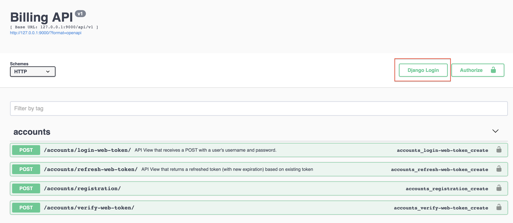

# The Billing project prototype.

*The purpose of this project is to experiment with Service Layer architecture and Repository pattern in Django, 
find the ways to easily migrate all project logic to another ORM or web framework if we need. The views.py, use_cases.py
(all business logic) and data.py of each app are completely clean from Django or DjangoORM dependencies. So you can
migrate it on a framework that you like.*

**Requirements:**
```
1) Each client in the system has one "wallet" containing money.
2) The information about a purse and the balance of funds on it is stored.
3) Clients can make money transfers to each other.
4) The information about all transactions in the client's purse is stored.
5) The project is an HTTP API that contains the main operations on
"wallets":
    1) creating a client with a purse;
    2) crediting funds to the client's purse;
    3) transfer of funds from one purse to another.
```

## Project Structure

- You can look at all ATD specifications of the project here `project/core/abstract_data_types.py`
- All use cases (businesses logic) you can find in `project/[app_name]/use_cases.py`
- ORM Repository realisation `project/core/repos.py`

## Database Schema.


## Project Architecture.

The architecture of the project was created with *Repository* and *Service Layer* patterns in mind.

**Service Layer** gives to us the purpose to separate all business logic as "use cases" in a separate module as Interactors. 
(ex: *project/payments/use_cases.py*). We can maintain all business logic in one place and reuse popular use cases.

**Repository** pattern chose in future purpose to switch to another ORM or raw SQL easily. We can add new repo types 
in the future and chose different repo to depend on business needs. `project/core/repos.py`
We also don't use any ModelSerializers, only plain Serializer. Views also clean from ORM code. `project/payments/views.py`

## Start Up.

You can easily start up the project with:
```
docker-compose up
```
When the project will start. You can go to the swagger page 
(this is also the main page in the project for easily debug in the current prototype project state) 
here: [localhost](http://localhost)
Then you can register user with swagger:

For test purposes user creates with is_staff permissions, so you can log in with django admin and has access to all api 
methods in swagger:


## Tests.

This project uses BDD style tests in `tests/featues/[some feature].feature` with *pytest_bdd* library.
The coolest test is asynchronous test race condition with *aiohttp*: `project/payments/tests/test_race_condition_in_transaction.py`

You can run test with
```
docker-compose exec web python -m pytest
```
The core bottleneck of such financial projects is a Race condition, we handle it in the main Transaction interactor:
project.payments.use_cases.MakeTransferInteractor
We lock sender table with **SELECT ... FOR UPDATE** (*select_for_update()* in ORM) and **UPDATE** (*F('balance') + sum* in ORM) to 
handle such effect. The worst thing that can be happing is net lag occurs during a transaction, two transactions make 
simultaneously, and the user has a minus in his wallet. To test such a case we use *aiohttp* library and asynchronous 
test + lag emulation in logic. You can check it here:

*MIT License*